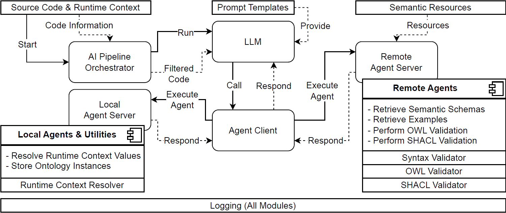

# Code2Onto
Framework that simplifies the transformation of source code including runtime context, into validated ontology instances with minimal developer effort.
Default settings are adapted for the [Semantic Time Series Ontology](https://github.com/semts-ontology/SemTS)
  
## Architecture   


## Usage
1. Ajdust the config.py, as well as the remote_agent_server.py to customize Code2Onto  
  
2. Add the following lines to the end of your code:  
``` python
from ai_pipeline_orchestrator import analyze_code  
analyze_code()  
```
  
3. Run code
